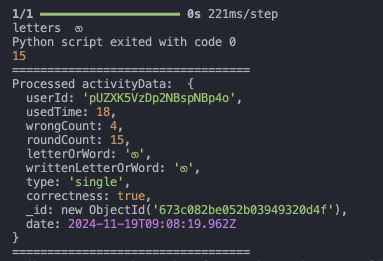

# Dyslexia Backend API - dyslexia-backend

This repository hosts the **Dyslexia Backend API**, the server-side implementation for the **Dyslexia Learning Assistant for Sinhala Children**. It powers the mobile application by providing secure authentication, exercise data, user activity tracking, and handwriting recognition using a Convolutional Neural Network (CNN) model.

---

## Features

- **User Management**:
  - Secure authentication using Firebase.
- **Exercise APIs**:
  - Fetch Sinhala letters and words based on type (single, two-letter, three-letter).
  - Save user activities, including progress, mistakes, and time taken.
- **Dashboard Support**:
  - Retrieve user activity and performance metrics.
- **Image Upload**:
  - API support for uploading Sinhala handwriting images for model training and evaluation.
- **Machine Learning Integration**:
  - **CNN Model** to analyze Sinhala handwritten characters and identify errors.
- **Feedback Mechanism**:
  - Provides real-time suggestions for corrections and alternative words based on handwriting analysis.

---

## How the Backend Works

1. **API Requests**:
   - The frontend sends user inputs (e.g., handwritten letters) and activity data to the backend via REST APIs.

2. **Data Handling**:
   - APIs fetch Sinhala letters or words based on user-selected difficulty (single, two-letter, three-letter).
   - User activity details are stored in MongoDB for progress tracking.

3. **Image Processing**:
   - Handwritten letters submitted by users are processed using a pre-trained **Convolutional Neural Network (CNN)** model.
   - The model predicts the handwritten character and compares it with the expected result.

4. **Feedback Generation**:
   - If the handwritten letter or word is incorrect, the backend highlights the error and suggests corrections.
   - This feedback is sent back to the frontend in real time for user improvement.

5. **Dashboard Insights**:
   - User performance metrics, such as accuracy and time spent, are aggregated and made available for analysis via the dashboard.

---

## Tech Stack

- **Backend Framework**: Node.js with Express.js  
- **Database**: MongoDB  
- **Authentication**: Firebase  
- **APIs**: REST APIs with Swagger documentation  
- **Machine Learning**: TensorFlow with CNN integration  

---

## Installation and Setup

### 1. Clone the Repository

   ```bash
   git https://github.com/A-Samod/dyslexia-app-backend-v2.git
  ```

### 2. Install Dependencies
```bash
cd dyslexia-backend
```
```bash
npm install
```

### 3. Set Up Environment Variables
- Create a .env file in the root directory and add the following variables:
```bash
# Server Configuration
PORT=4000

# Database Configuration
MONGO_URI=mongodb+srv://<user>:<pass>@cluster0.fyc2lpb.mongodb.net/<db-name>?retryWrites=true&w=majority&appName=Cluster0
```

### 4. Run the Server
Start the backend server:
```bash
npm start
```
The server will run at http://localhost:4000 by default.

---

## API Endpoints

| HTTP Method | Endpoint                           | Description                                              |
|-------------|------------------------------------|----------------------------------------------------------|
| `POST`      | `/uploads`                        | Upload handwriting images for processing.                |
| `GET`       | `/api/letters/:type`              | Fetch Sinhala letters by type (e.g., single, two, three).|
| `POST`      | `/api/letters/add`                | Add new Sinhala letters or words for exercises.          |
| `POST`      | `/api/user-activities/submit`     | Submit user activity details.                            |
| `GET`       | `/api/user-activities/activities/:userId` | Fetch user activities for a specific user.           |

---
### API Responses :



---
### Related Repositories
Frontend (Mobile App): [Mobile App Repository](https://github.com/A-Samod/dyslexia-app-v2)

---